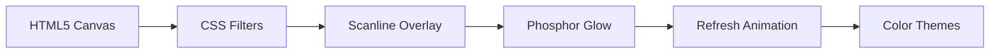

# VT340 Terminal Portfolio  

[](https://opensource.org/licenses/MIT)  
[](https://yourusername.github.io/vt340-portfolio)  
  

An retro computing experience showcasing my developer portfolio through an authentic DEC VT340 terminal emulator with CRT effects and interactive commands.  

---

## Features  

---

### Authentic Terminal Experience  
- **CRT Visual Effects**: Scanlines, phosphor glow, and screen flicker  
- **Color Themes**: Green, Amber, Blue, and Monochrome modes  
- **Audio Atmosphere**: Key clicks, boot sounds, and navigation beeps
  
---

### Interactive Commands  
```bash
╭───────────────────┬───────────────────────────────────────────╮
│ Command           │ Description                               │
├───────────────────┼───────────────────────────────────────────┤
│ about             │ Show bio and contact information          │
│ education         │ Display academic background               │
│ skills            │ View technical capabilities               │
│ projects          │ Explore development projects              │
│ theme [color]     │ Change terminal color scheme              │
│ resume            │ Open full resume in new tab               │
│ clear             │ Reset terminal display                    │
│ exit              │ End session                               │
╰───────────────────┴───────────────────────────────────────────╯
```
---

###CRT Simulation Architecture

---

###Project Structure
```text
vt340-portfolio/
├── crt.css          # CRT effects
├── terminal.css     # Terminal styles
├── terminal.js      # Interactive logic
├── index.html       # Main interface
└── resume.pdf       # Downloadable resume
```
---

###Keyboard Shortcuts
Key Combination	Action
Tab	Command autocomplete
↑/↓	Navigate history
Ctrl+C	Interrupt command

---

###Acknowledgments

    DEC VT340 terminal for inspiration

    Cascadia Code font

    Vintage computing enthusiasts community
