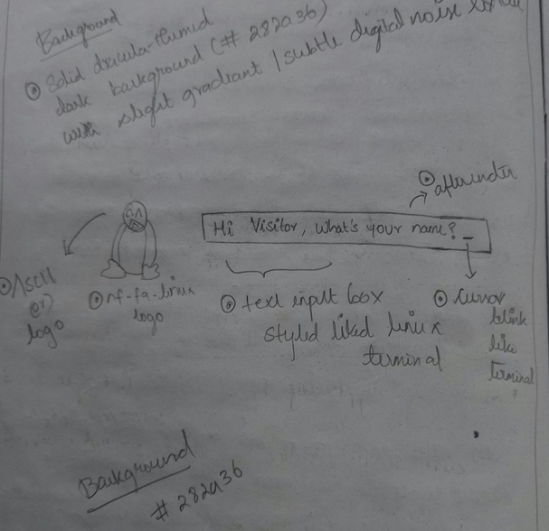
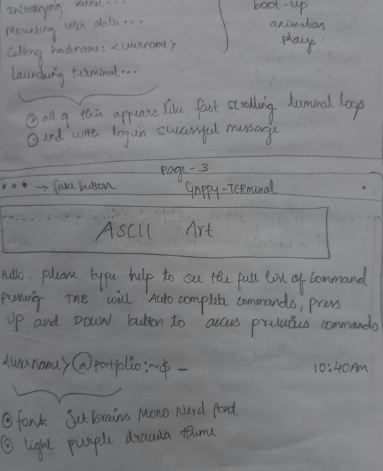
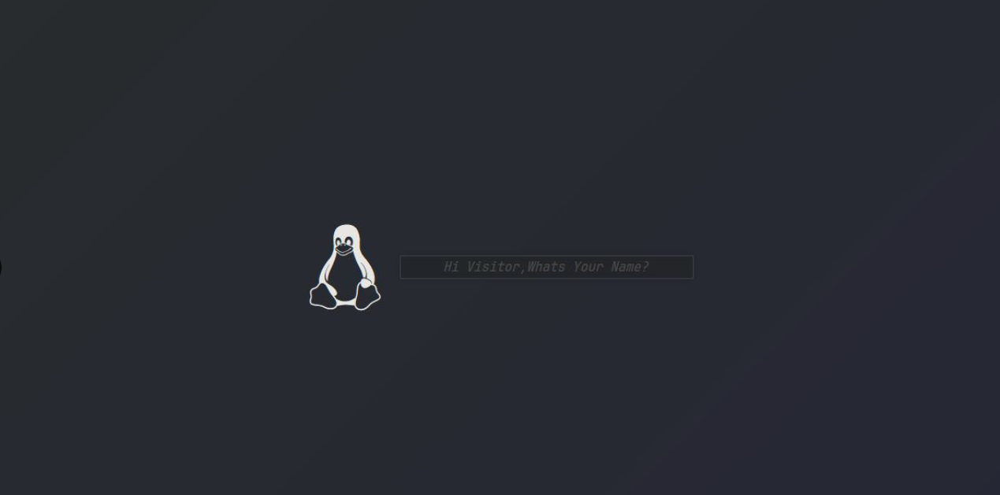
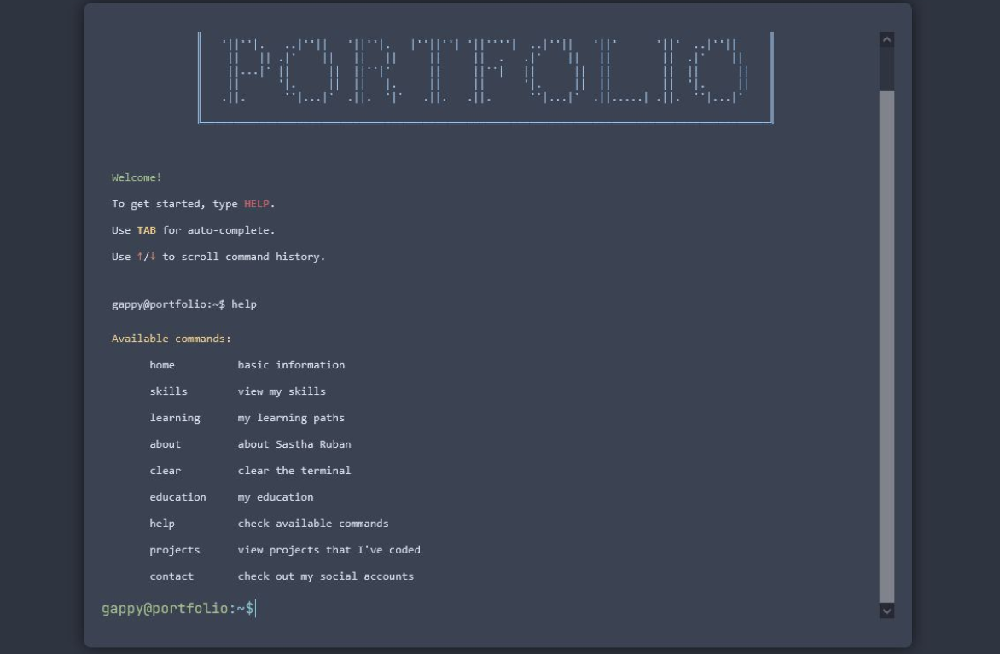

[ LIVE ](https://gappyjosuke.github.io/Retro-Portfolio/)

# Portfolio Dev Log: The VT340 Journey
**Project Status :** Legacy (Maintenance Mode)  
**Focus :** Retro CRT Emulation & Terminal UI/UX

---

## Table of Contents
* [Chapter 1: The Initial Spark](#chapter-1)
* [Chapter 2: Phase 1 - The Tux Era](#chapter-2)
* [Chapter 3: Shifting to Retro-Hardware Aesthetics](#chapter-3)
* [Chapter 4: The Messy Reality of the Codebase](#chapter-4)
* [Chapter 5: Managing Asynchronous Audio & Text](#chapter-5)
* [Chapter 6: Deep Space Protocol](#chapter-6)
* [Chapter 7: Moving Beyond Web Development](#chapter-7)

---

## Chapter 1
> **The Initial Spark**

This project didn't start in a code editor; it started on paper. During a 3rd-year [MERN stack](https://www.mongodb.com/mern-stack) workshop conducted by [SPACE_ZEE](https://www.spacezee.net/), everyone tasked to make thier own web layouts,on that time i was really into distro hopping and stuffs so I wanted to build something like a terminal. I sat down with a notebook and sketched the [CLI (Command Line Interface)](https://en.wikipedia.org/wiki/Command-line_interface) prompts and boot logs before writing a single line of [CSS](https://developer.mozilla.org/en-US/docs/Web/CSS).

  <table>
    <tr>
      <td align="center">
         
        Initial Layout Sketch
      </td>
      <td align="center">
         
        Command Logic Planning
      </td>
    </tr>
  </table>

---

## Chapter 2
> **Phase 1: The Tux Era**

The first functional version was built rapidly. It was clean and modern, inspired by contemporary Linux distributions. It featured the [Tux mascot](https://en.wikipedia.org/wiki/Tux_(mascot)) and a simple Dracula color palette. It served its purpose as a portfolio, but it lacked the "soul" of the older hardware I admired.

  <table>
    <tr>
      <td align="center">
         
        Main Prompt
      </td>
      <td align="center">
         
        Help Command Output
      </td>
    </tr>
  </table>

---

## Chapter 3
> **Shifting to Retro-Hardware Aesthetics**

I decided to overhaul the entire project to mimic a [DEC VT340](https://en.wikipedia.org/wiki/VT340) video terminal. This required a deep dive into [CRT (Cathode Ray Tube)](https://en.wikipedia.org/wiki/Cathode-ray_tube) visual artifacts—adding scanlines, screen flicker, and color-specific glows (Green,Vapor, Cyan). The goal was to make the browser feel like a heavy piece of 80s hardware.

  <table>
    <tr>
      <td align="center">
         
        Green Theme
      </td>
      <td align="center">
         
        VaporWave Green
      </td>
      <td align="center">
         
        Cyan Theme
      </td>
    </tr>
  </table>

---

## Chapter 4
> **The Messy Reality of the Codebase**

As the project grew, the code became a "living document" of my learning process. It is, admittedly, a mess. The repository is filled with unused methods, abandoned implementations, and "ghost" code. However, this messiness is a byproduct of extreme modification and rapid prototyping. It’s a low-maintenance codebase that somehow achieves a high-end result.

---

## Chapter 5
> **Managing Asynchronous Audio & Text**

#
One of the hardest technical hurdles was syncing the [typewriter effect](https://en.wikipedia.org/wiki/Typewriter_style) with the audio. If a user spammed the "Next" button, the sounds would overlap and create "audio ghosting." I had to implement a [nuclear kill-switch](https://developer.mozilla.org/en-US/docs/Web/API/HTMLAudioElement/pause) using `async/await` to ensure that every audio thread and typing loop was terminated instantly upon navigation.

---

## Chapter 6
> **Deep Space Protocol**

  
   
  <b>Procedural Starfield Generation</b>

#
To prevent the terminal from feeling "dead" when empty, I created the Deep Space Protocol. This is a [procedural generation](https://en.wikipedia.org/wiki/Procedural_generation) script that spawns a dense starfield using CSS animations whenever the `CLEAR` command is triggered. It turns a simple utility command into a visual experience.

---

## Chapter 7
> **Moving Beyond Web Development**

I’ve updated this portfolio every six months for years, and it was a great way to learn. But honestly, Web Development has started to feel boring. I’m pretty much done with further updates to this project. 

I’ve shifted my focus entirely to **Game Development**, where I can work with more complex rendering and logic. If you want to see what I’m working on now, check out my current project:

**[The Pious Child](https://github.com/Gappyjosuke/the-pious-child)**

---

**Is the code clean? No. Is it built exactly how I imagined it on that piece of paper? Yes.**

